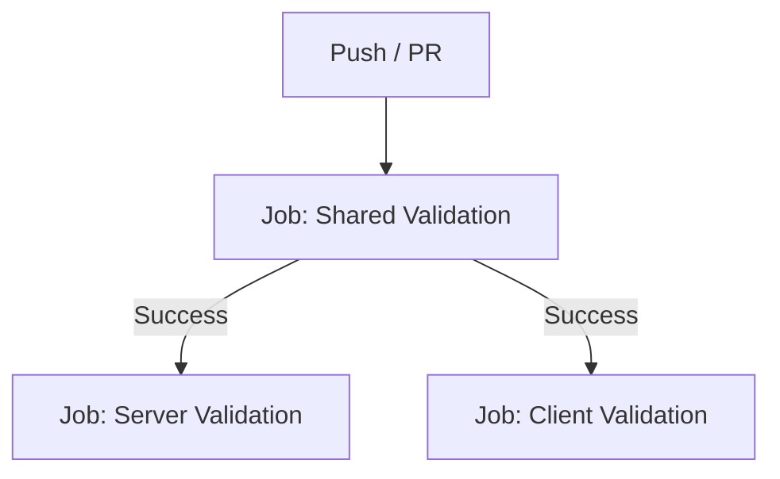

# CI Pipeline Design

## Workflow Structure

The CI pipeline will be split into jobs to enforce the dependency chain requested:

## Job Details

### 1. Shared Validation
*   **Scope**: `@rps/shared`
*   **Steps**:
    *   `npm ci` (Install all dependencies - needed for linking)
    *   `npm run lint -- shared/` (Lint specific dir)
    *   `npm run build --workspace=@rps/shared` (Type check)

### 2. Application Validation
*   **Scope**: `@rps/server`, `@rps/client`
*   **Depends On**: `Shared Validation`
*   **Strategy**: Can run as matrix or separate parallel jobs. Separate jobs allow clearer failure reporting.
*   **Server Steps**:
    *   `npm ci`
    *   `npm run lint -- server/`
    *   `npm run build --workspace=@rps/server`
*   **Client Steps**:
    *   `npm ci`
    *   `npm run lint -- client/`
    *   `npm run build --workspace=@rps/client`

## CodeRabbit
Standard configuration to enable AI reviews on Pull Requests.
